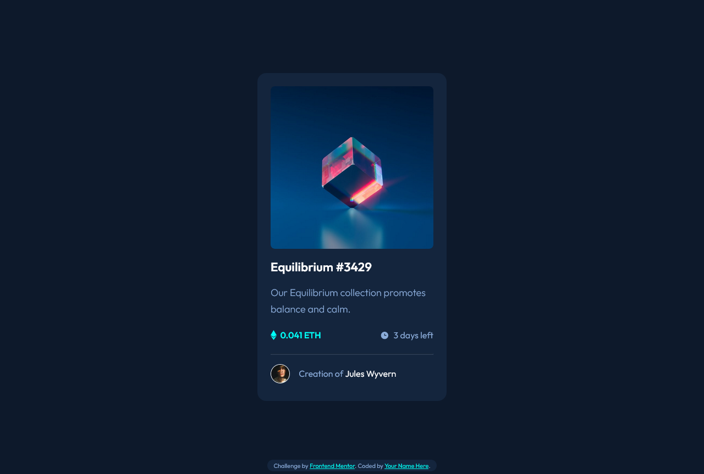

# Frontend Mentor - NFT preview card component solution

This is a solution to the [NFT preview card component challenge on Frontend Mentor](https://www.frontendmentor.io/challenges/nft-preview-card-component-SbdUL_w0U). Frontend Mentor challenges help you improve your coding skills by building realistic projects. 

## Table of contents

- [Overview](#overview)
  - [Screenshot](#screenshot)
  - [Links](#links)
- [My process](#my-process)
  - [Built with](#built-with)
  - [What I learned](#what-i-learned)
  - [Continued development](#continued-development)
  - [Useful resources](#useful-resources)
- [Author](#author)


## Overview


### Screenshot




### Links

- Solution URL: [Add solution URL here](https://your-solution-url.com)
- Live Site URL: [Add live site URL here](https://your-live-site-url.com)

## My process

### Built with

- Semantic HTML5 markup
- CSS custom properties
- Flexbox
- Mobile-first workflow


### What I learned

Stacking elements on top of each other

```css
.img-components {
    position: relative;
    height: 100%;
    cursor: pointer;
}
.banner-img {
    width: 100%;

    border-radius: .5em;
}

.blue-panel {
    width: 100%;
    height: 99%;
    position: absolute;
    top: 0;
    left: 0;
    border-radius: .5em;
    opacity: 0;
    background-color: var(--cyan);
    transition: .1s ease-in-out;
}

.view-vector {
    position: absolute;
    left: 50%;
    top: 50%;
    transform: translate(-50%, -50%);
    display: none;

}
```

### Continued development

Stacking elements on top of each other.

Position elements relative to each other

### Useful resources

- [W3schools](https://www.w3schools.com/howto/howto_css_image_text.asp) - This helped me to understand how to stack element on top of each other.


## Author

- Frontend Mentor - [@Mr-jaw](https://www.frontendmentor.io/profile/Mr-jaw)
